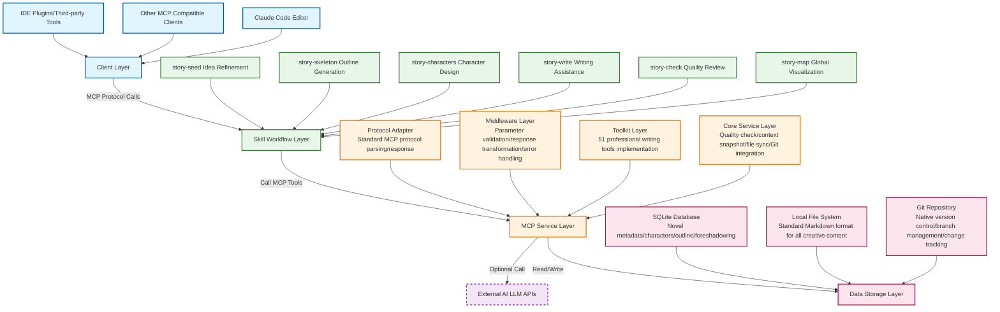

# StoryMuse: AI-Powered Novel Writing Toolkit

> Transform creative ideas into full-length novels with intelligent, privacy-first assistance. Built for writers and developers who demand full control over their creative process.

[](https://opensource.org/licenses/MIT)
[]()
[]()
[]()
[]()

[English](README.md) | [中文](README-zh.md)

---

## ✨ Core Capabilities
StoryMuse implements a structured, AI-assisted workflow that guides creators from initial concept to publish-ready novel:

### 🎯 Intelligent Writing Pipeline
- **Idea Refinement**: Turn one-sentence concepts into structured story cores with guided prompting
- **Outline Generation**: Automatic 3-act, 4-level narrative structure following classic storytelling principles
- **Character Design**: Deep character profiling with dynamic relationship network mapping and evolution tracking
- **Chapter Composition**: Context-aware writing assistance with built-in multi-version management and rollback
- **Quality Assurance**: Character consistency validation, plot hole detection, foreshadowing tracking, and platform compliance scanning
- **Global Visibility**: Comprehensive progress tracking and story state visualization

### ⚡ Design Principles
- **Privacy First**: 100% local data storage, no creative content ever uploaded to external servers
- **Low-Context Optimization**: Intelligent context snapshotting keeps token usage ≤ 2000, even for million-word projects
- **Developer Native**: Git-first version management, plain-text Markdown storage, and extensible plugin architecture
- **Protocol Standard**: Works with all AI assistants and editors supporting the Model Context Protocol (MCP)
- **Production Grade**: Optimized for long-form writing, supporting projects with 1M+ words and hundreds of chapters

---

## 🚀 Quick Start

### Installation Method 1: From Git Repository
If you want to use the latest development version:
1. Open Claude Code editor
2. Enter: `/plugin marketplace add https://github.com/cvanly2011/StoryMuse.git`
3. After marketplace installation is complete, enter: `/plugin install StoryMuse@storymuse-dev`
4. Enter: `/reload-plugins` to reload the plugin list
5. Create a new empty folder and start writing immediately

The plugin will automatically install dependencies and build the service on first run. All functionality works out of the box, no manual setup required.

### Project Structure
StoryMuse generates a clean, human-readable, and tool-agnostic project structure:
```
your-novel/
├── story-seed.md             # Core concept, worldbuilding, and narrative premise
├── outline.md                # Full 3-act structure with chapter-level breakdown
├── characters.md             # Character profiles, arcs, and relationship mapping
└── chapters/                 # Chapter content as standard, publish-ready Markdown files
    ├── chapter-01.md
    ├── chapter-02.md
    └── ...
```

No proprietary formats, no vendor lock-in—all content is plain text that you fully own and control.

---

## 🏗️ Technical Architecture
StoryMuse uses a modular, layered architecture designed for performance and extensibility, following the same design patterns as professional developer tools:



### Architecture Description
- **Client Layer**: Supports all MCP-compatible AI assistants and editors, no platform lock-in
- **Skill Workflow Layer**: Human-readable workflow definitions providing out-of-the-box writing guidance, fully extensible
- **MCP Service Layer**: Core business implementation, providing 51 professional writing tools via standard protocol, all logic executed locally
- **Data Storage Layer**: Hybrid storage architecture, metadata stored in SQLite, creative content stored as plain-text Markdown, Git provides version management
- **External Dependencies**: AI LLM calls are completely optional, core functionality works fully offline

### Key Technical Features
- **WAL-Optimized SQLite**: 10x faster read/write performance for large writing projects
- **NLP-Powered Context Management**: Intelligent summarization keeps context windows small and relevant
- **File Watcher Daemon**: Automatic sync between local file edits and internal metadata database
- **Branch-Aware Storage**: Git-native architecture enables parallel story version experimentation
- **Extensible Rule Engine**: Plugin-based platform rule system and quality checkers

---

## 📖 Standard Workflow
StoryMuse implements a battle-tested creative workflow used by professional fiction writers:

### 1. Ideation Phase
Refine your core concept using the `/story-seed` module, capturing:
- Narrative theme and core conflict
- Worldbuilding rules and constraints
- Character motivations and story arcs
- Unique selling points and audience positioning

### 2. Outlining Phase
Generate a complete narrative structure with `/story-skeleton`:
- Standard 3-act structure (Setup → Confrontation → Resolution)
- 4-level hierarchy (Act → Volume → Chapter → Scene)
- Chapter-level goals, conflict points, and turning points
- Foreshadowing placement and recovery plan

### 3. Character Development
Build layered, consistent characters using `/story-characters`:
- Character profiles with internal conflicts, motivations, and growth arcs
- Dynamic relationship network tracking relationship evolution across chapters
- Automatic character consistency enforcement across the entire narrative

### 4. Writing Phase
Draft your novel chapter by chapter with `/story-write`:
- Automatic context loading with core premise, recent events, and unresolved plot threads
- Multi-version chapter management with one-click rollback
- Automatic key event and character state extraction for continuity tracking

### 5. Review Phase
Ensure quality and consistency with `/story-check`:
- Character behavior consistency validation against established profiles
- Foreshadowing recovery tracking to identify plot threads left hanging
- Plot logic and timeline verification
- Target platform compliance and content policy scanning

### 6. Publishing
All content is standard Markdown—publish directly to any platform without conversion or export.

---

## 🎯 Platform Adaptation
Built-in support for all major web fiction publishing platforms with automatic rule validation:
- **Content Compliance**: Platform-specific sensitive word scanning and content policy validation
- **Structure Optimization**: Chapter length and narrative rhythm recommendations per platform audience
- **Style Guidance**: Writing style adaptation for different demographic expectations
- **Review Pre-Check**: Pre-emptive scanning for common review rejection reasons

Currently supports: Qidian, Jinjiang, Tomato Novel, Qimao, Zongheng, 17K, Douban Read, and all Yuewen platforms.

---

## 🌿 Git-Native Version Control
StoryMuse is designed from the ground up to integrate seamlessly with Git version management:
- **Multiple Plotlines**: Use separate branches to experiment with different story directions without affecting the main draft
- **Alternative Endings**: Write and compare multiple endings in isolated branches
- **Platform Adaptation**: Maintain separate versions optimized for different publishing platform requirements
- **Collaboration**: Multiple writers can work on different parts of the story simultaneously with standard Git workflows

No proprietary version control system—use the tools you already know and love.

---

## 📊 Performance
Optimized for professional long-form writing:
- 1M+ word project loading time: < 100ms
- Context snapshot generation: < 50ms
- Automatic hourly backups with 7-version retention
- Zero network latency—all processing done locally

---

## 🔒 Privacy & Security
- **100% Local Execution**: All creative content never leaves your device
- **Zero Telemetry**: No usage data collection, no analytics, no tracking of any kind
- **Open Formats**: All content stored as standard Markdown and portable SQLite files
- **No Vendor Lock-in**: You fully own your data, no proprietary formats or restrictions

---

## 🛠️ Development & Extension
StoryMuse is fully open and extensible:

### Build from Source
```bash
git clone https://github.com/cvanly2011/StoryMuse.git
cd story-muse/mcp-server
npm install
npm run build
```

### Extend Functionality
- **Add Platform Rules**: Add JSON configuration files in `mcp-server/src/config/platform-rules/`
- **Create New Workflows**: Add Markdown skill definitions in the `skills/` directory
- **Extend Check Engines**: Add new quality check logic in `mcp-server/src/services/check.service.ts`
- **Custom Integrations**: Extend the MCP API to integrate with your writing toolchain

See the [Developer Guide](docs/developer-guide.md) for comprehensive documentation.

---

## 🤝 Contributing
Contributions are welcome! Whether you're:
- Adding support for new publishing platforms
- Improving quality check engines
- Adding new skill workflows
- Fixing bugs
- Improving documentation

Please feel free to submit a Pull Request. For major changes, open an issue first to discuss what you would like to change.

---

## 📝 Changelog
See [CHANGELOG.md](docs/changelog.md) for version history and release notes.

---

## 📄 License
MIT License - see [LICENSE](LICENSE) file for full details.

---

> Built with ❤️ for writers who want technology to amplify their creativity, not control it.
